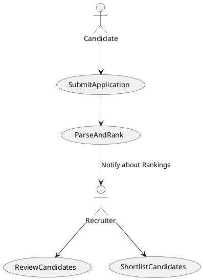
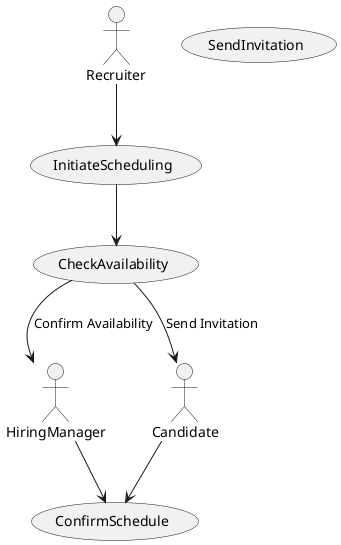
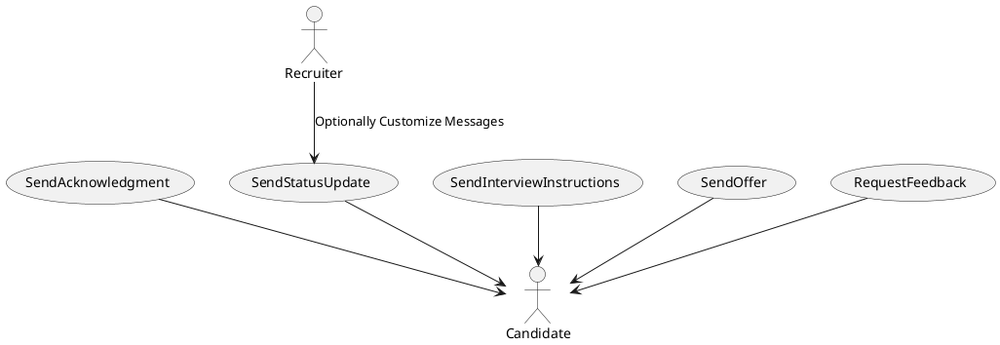

# LTI Applicant Tracking System (ATS)

## Project Overview

LTI is an innovative Applicant Tracking System (ATS) designed specifically for medium-sized businesses. It leverages advanced AI data analysis to streamline the recruitment process, enhance HR efficiency, and foster real-time collaboration between recruiters and hiring managers. By automating routine tasks and providing insightful analytics, LTI empowers organizations to make faster and more informed hiring decisions.

## Features

- **AI-Powered Applicant Screening**: Utilizes machine learning algorithms to analyze resumes and rank candidates based on fit, significantly reducing manual screening time.
- **Real-Time Collaboration Tools**: Integrated platforms for communication between recruiters and hiring managers.
- **Automation of Routine Tasks**: Frees up HR professionals by automating scheduling and notifications.
- **User-Friendly Interface**: Quick adoption with minimal training.
- **Advanced Analytics**: Actionable insights via dashboards.
- **Scalability**: Easily integrates with existing HR systems and scales with the business.

## Installation

To install the project dependencies, run:

```sh
npm install
```

## Usage

To start the project, run:

```sh
npm start
```

## Contributing

Please read [CONTRIBUTING.md](CONTRIBUTING.md) for details on our code of conduct, and the process for submitting pull requests.

## License

This project is licensed under the MIT License - see the [LICENSE.md](LICENSE.md) file for details.

## Documentation

For detailed documentation, please refer to the [Project Documentation](PROJECTCONTEXT-RJD.MD).

## Main Use Cases

### Use Case 1: AI-Powered Candidate Screening



### Use Case 2: Collaborative Interview Scheduling



### Use Case 3: Automated Candidate Communication

