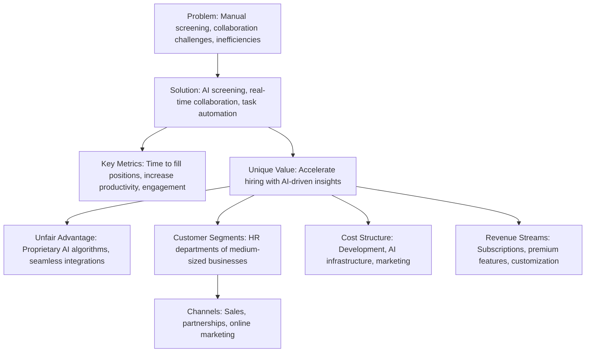
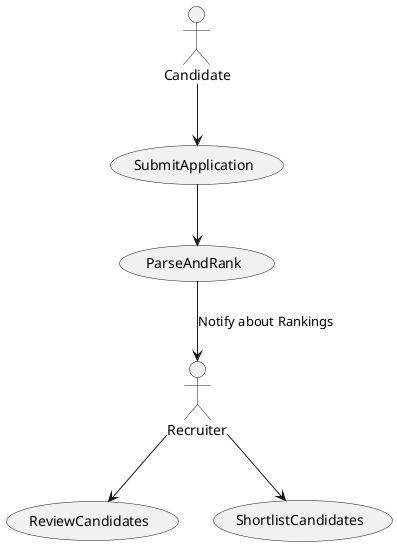
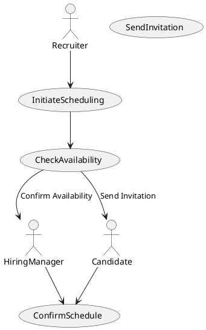
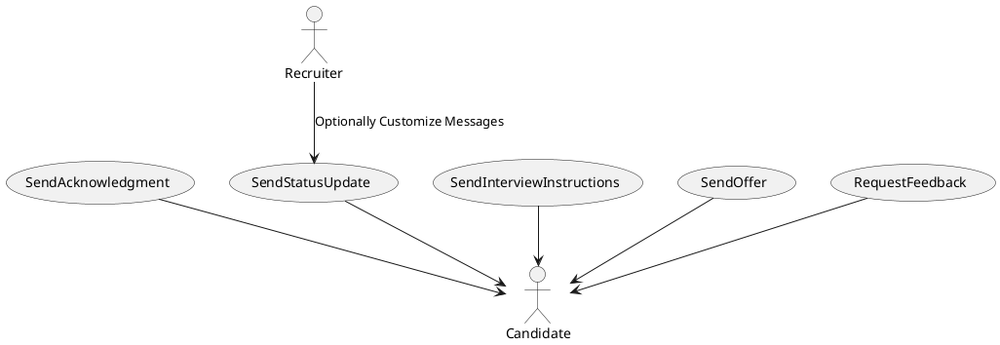
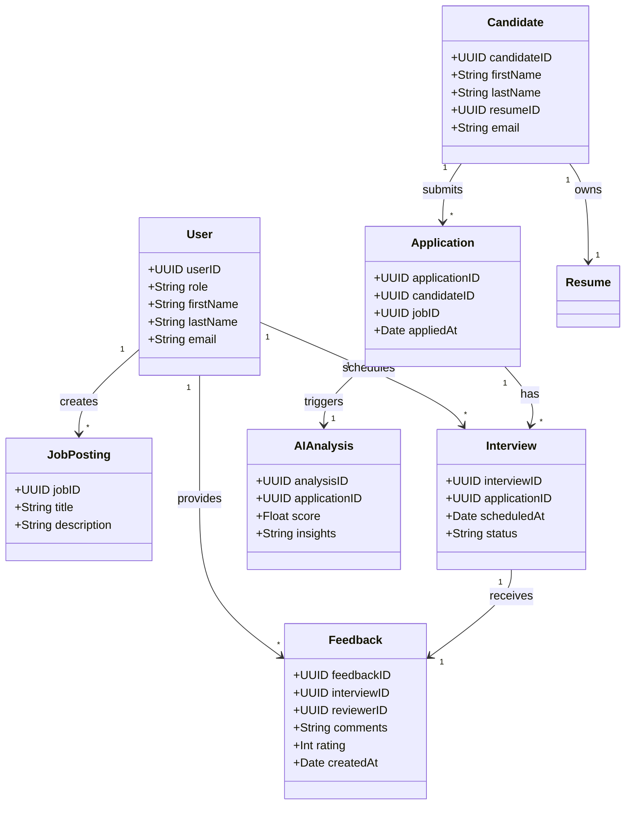
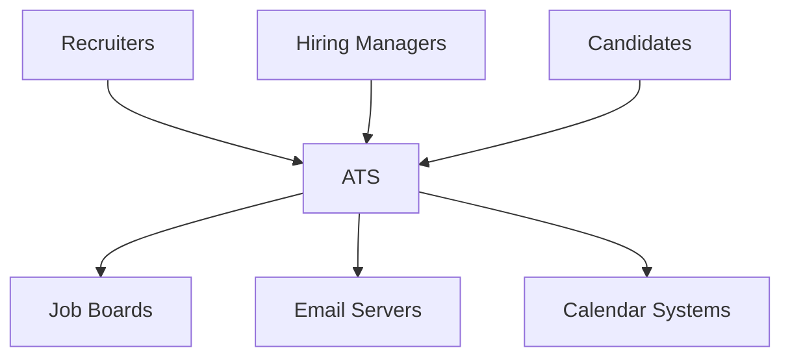
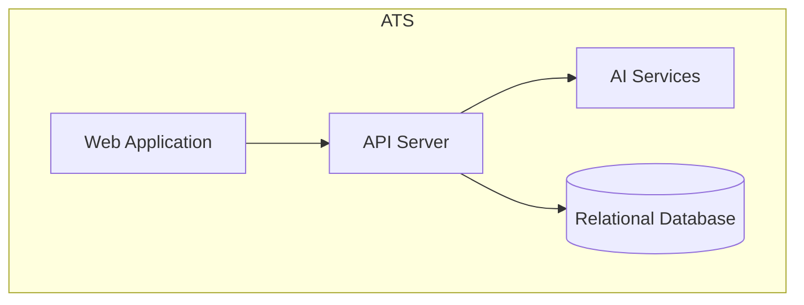
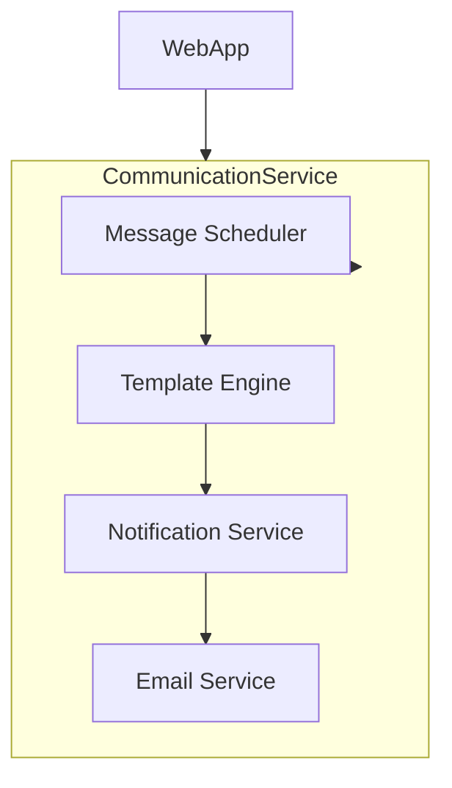
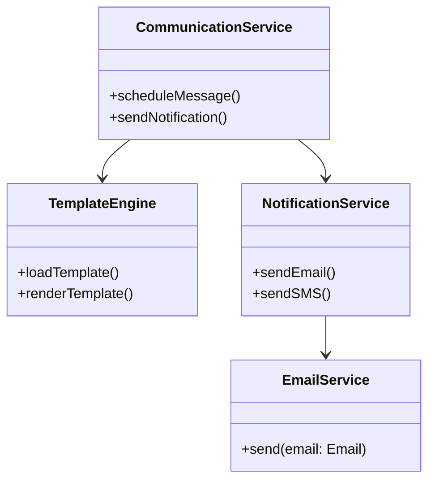

# **LTI Applicant Tracking System (ATS) Documentation**

## **Table of Contents**

- [**LTI Applicant Tracking System (ATS) Documentation**](#lti-applicant-tracking-system-ats-documentation)
  - [**Table of Contents**](#table-of-contents)
  - [**Software Description**](#software-description)
    - [**Added Value and Advantages**](#added-value-and-advantages)
    - [**Lean Canvas**](#lean-canvas)
  - [**Main Use Cases**](#main-use-cases)
    - [**Use Case 1: AI-Powered Candidate Screening**](#use-case-1-ai-powered-candidate-screening)
    - [**Use Case 2: Collaborative Interview Scheduling**](#use-case-2-collaborative-interview-scheduling)
    - [**Use Case 3: Automated Candidate Communication**](#use-case-3-automated-candidate-communication)
  - [**Data Model**](#data-model)
    - [**Class Diagram for Data Model**](#class-diagram-for-data-model)
  - [**C4 Model Diagrams**](#c4-model-diagrams)
    - [**Level 1: System Context Diagram**](#level-1-system-context-diagram)
    - [**Level 2: Container Diagram**](#level-2-container-diagram)
    - [**Level 3: Component Diagram for Use Case 3**](#level-3-component-diagram-for-use-case-3)
    - [**Level 4: Code Structure Diagram for Use Case 3**](#level-4-code-structure-diagram-for-use-case-3)

---

## **Software Description**

LTI is an innovative Applicant Tracking System (ATS) designed specifically for medium-sized businesses. It leverages advanced AI data analysis to streamline the recruitment process, enhance HR efficiency, and foster real-time collaboration between recruiters and hiring managers. By automating routine tasks and providing insightful analytics, LTI empowers organizations to make faster and more informed hiring decisions.

### **Added Value and Advantages**

- **AI-Powered Applicant Screening**: Utilizes machine learning algorithms to analyze resumes and rank candidates based on fit, significantly reducing manual screening time.
- **Real-Time Collaboration Tools**: Integrated platforms for communication between recruiters and hiring managers.
- **Automation of Routine Tasks**: Frees up HR professionals by automating scheduling and notifications.
- **User-Friendly Interface**: Quick adoption with minimal training.
- **Advanced Analytics**: Actionable insights via dashboards.
- **Scalability**: Easily integrates with existing HR systems and scales with the business.

### **Lean Canvas**

---

## **Main Use Cases**

### **Use Case 1: AI-Powered Candidate Screening**

### **Use Case 2: Collaborative Interview Scheduling**

### **Use Case 3: Automated Candidate Communication**

---

## **Data Model**

### **Class Diagram for Data Model**

---

## **C4 Model Diagrams**

### **Level 1: System Context Diagram**

This diagram provides a high-level overview of how external users and systems interact with the ATS.

### **Level 2: Container Diagram**

This diagram shows the containers within the ATS and how they communicate.

### **Level 3: Component Diagram for Use Case 3**

### **Level 4: Code Structure Diagram for Use Case 3**

